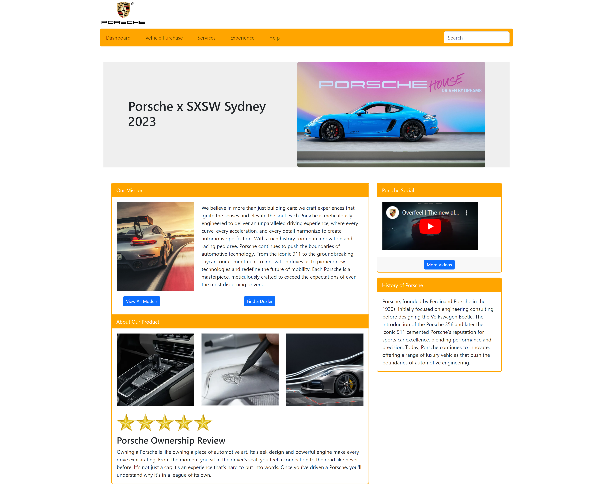
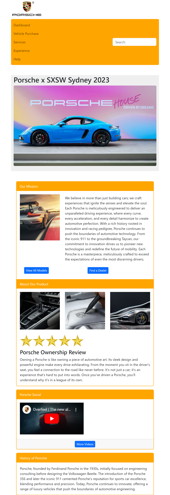
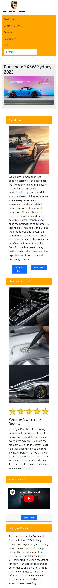

# Responsive-Webpage-Design

A fully responsive and visually appealing homepage design for Porsche, designed with **HTML5**, **CSS3**, and **Bootstrap 5**. The project aims to provide an immersive user experience while showcasing Porsche's brand identity.

---

## Screenshots

| Desktop View                                | Tablet View                                | Mobile View                                |
|---------------------------------------------|--------------------------------------------|--------------------------------------------|
|  |  |  |

---

## Features

- **Responsive Design**: Fully optimized for desktop, tablet, and mobile views.
- **Modern Navigation**: An intuitive and accessible navbar with key sections.
- **Rich Content Areas**: Features mission statements, product details, and customer reviews.
- **Embedded Media**: Includes a YouTube video integration to highlight Porsche's media presence.
- **Aesthetic Design**: Follows Porsche's clean and luxury-driven brand aesthetics.

---

## Technologies Used

-  HTML5
-  CSS3
-  Bootstrap 5

---
